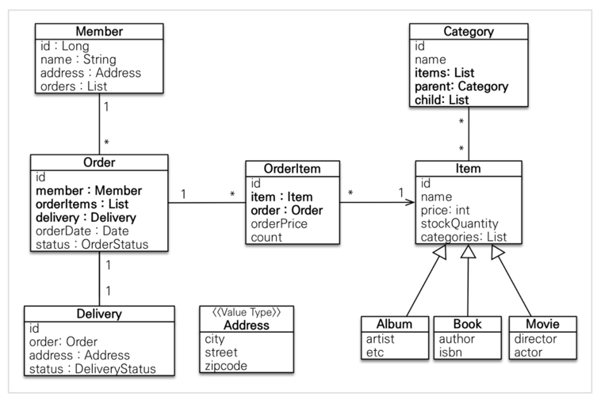

# H2 데이터베이스 설치
* 개발이나 테스트 용도로 가볍고 편리한 DB, 웹 화면 제공

1. 윈도우 설치 버전: https://h2database.com/h2-setup-2019-10-14.exe 
2. 윈도우, 맥 , 리눅스 실행 버전: https://h2database.com/h2-2019-10-14.zip
3. https://www.h2database.com

* 다운로드 및 설치 데이터베이스 파일 생성 방법
> chmod 755 ./h2.sh
> 
> jdbc:h2:~/jpashop 최초 한 번 실행
> 
> ~/jpashop.mv.db 파일 생성 확인
> 
> 이후 부터는 jdbc:h2:tcp://localhost/~/jpashop 이렇게 접속

# build 후 jar 실행
> ./gradlew clean build
>
> cd ./build/lib
>
> java -jar jpashop-0.0.1-SNAPSHOT.jar

### 참고: 외래 키가 있는 곳을 연관관계의 주인으로 정해라.
> 연관관계의 주인은 단순히 외래 키를 누가 관리하냐의 문제이지 비즈니스상 우위에 있다고 주인으로 정하면
안된다.
> 예를 들어서 자동차와 바퀴가 있으면, 일대다 관계에서 항상 다쪽에 외래 키가 있으므로 외래 키가 있는 바퀴를 연관관계의 주인으로 정하면 된다.
> 물론 자동차를 연관관계의 주인으로 정하는 것이 불가능 한 것은 아니지만, 자동차를 연관관계의 주인으로 정하면 자동차가 관리하지 않는 바퀴 테이블의 외래 키 값이 업데이트 되므로 관리와 유지보수가 어렵고, 
> 추가적으로 별도의 업데이트 쿼리가 발생하는 성능 문제도 있다. 자세한 내용은 JPA 기본편을 참고하자.

## 회원 엔티티


## 회원 테이블 분석


### 참고: 이론적으로 Getter, Setter 모두 제공하지 않고, 꼭 필요한 별도의 메서드를 제공하는게 가장 이상적이다.
> 하지만 실무에서 엔티티의 데이터는 조회할 일이 너무 많으므로, Getter의 경우 모두 열어두는 것이 편리하다.
> 
> Getter는 아무리 호출해도 호출 하는 것 만으로 어떤 일이 발생하지는 않는다. 
> 
> 하지만 Setter는 문제가 다르다. Setter를 호출하면 데이터가 변한다. Setter를 막 열어두면 가까운 미래에 엔티티에가 도대체 왜 변경되는지 추적하기 점점 힘들어진다. 
> 
> 그래서 엔티티를 변경할 때는 Setter 대신에 변경 지점이 명확하도록 변경을 위한 비즈니스 메서드를 별도로 제공해야 한다.

# 모든 연관관계는 지연로딩으로 설정한다!
> 즉시로딩( EAGER )은 예측이 어렵고, 어떤 SQL이 실행될 지 추적하기 어렵다. 특히 JPQL을 실행할 때 N+1 문제가 자주 발생한다.
> 
> 예를들면 Order 리스트를 조회하는 데 FK인 Member가 EAGER인 경우, 모든 Order의 Member가 단건식 조회되어 N+1 문제가 발생한다.
> 
> 실무에서 모든 연관관계는 지연로딩( LAZY )으로 설정해야 한다.
> 
> 연관된 엔티티를 함께 DB에서 조회해야 하면, 'fetch join' 또는 '엔티티 그래프 기능' 을 사용한다!
> 
> [주의!] @XToOne(OneToOne, ManyToOne) 관계는 기본이 즉시로딩( EAGER )이므로 직접 지연로딩( LAZY )으로 설정해야한다!.


# 컬렉션은 필드에서 초기화 하자.
> 컬렉션은 필드에서 바로 초기화 하는 것이 안전하다.
> 
> null 문제에서 안전하다.
> 
> 하이버네이트는 엔티티를 영속화 할 때, 컬랙션을 감싸서 하이버네이트가 제공하는 내장 컬렉션으로 변경한다.
> 
> 만약 getOrders() 처럼 임의의 메서드에서 컬력션을 잘못 생성하면 하이버네이트 내부 메커니즘에 문제가 발생할 수 있다.
> 
> 따라서 필드레벨에서 생성하는 것이 가장 안전하고, 코드도 간결하다.

```java
Member member = new Member();
System.out.println(member.getOrders().getClass());
em.persist(member);
System.out.println(member.getOrders().getClass());

//출력 결과
class java.util.ArrayList
class org.hibernate.collection.internal.PersistentBag
```

### 하이버네이트 기존 구현: 
* 엔티티의 필드명을 그대로 테이블의 컬럼명으로 사용
* SpringPhysicalNamingStrategy

# 연관관계 편의 메서드를 설정하자
```java
/**
 * 연관관계를 컨트롤하는 쪽에서
 * 연관관계 편의 메서드를 제공하자
 * @param orderItem
 */
public void addOrderItem(OrderItem orderItem) {
    orderItems.add(orderItem);
    orderItem.setOrder(this);
}
```

----
